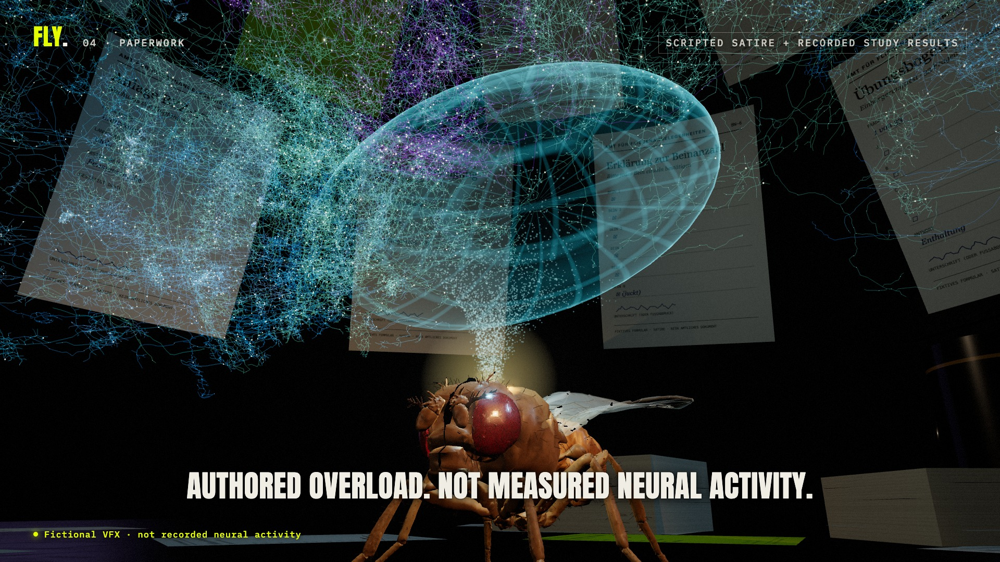

<p align="center">
  <a href="https://fly-navy.vercel.app"></a>
</p>

<h1 align="center">FLY</h1>

<p align="center">
  <strong>Can a fly-brain model survive German bureaucracy?</strong><br/>
  A scientific comedy built on the real male fruit fly connectome.<br/>
  Every number on screen comes from a recorded experiment. Every gag is labelled as a gag.
</p>

<p align="center">
  <a href="https://fly-navy.vercel.app"><strong>Watch the 68-second story</strong></a> &nbsp;|&nbsp;
  <a href="https://fly-navy.vercel.app/lab.html">Lab note 002</a> &nbsp;|&nbsp;
  <a href="docs/STORY.md">The write-up</a> &nbsp;|&nbsp;
  <a href="https://raxxo.shop">RAXXO Studios</a>
</p>

<p align="center">
  
  
  
  
  
</p>

<p align="center">
  
  
  
  
</p>

---

## The joke, and the dataset that made it a project

A fly has no passport and no reason to understand German constitutional law. In September 2026 Google, HHMI Janelia and collaborators released a proofread reconstruction of the male fruit fly nervous system: 166,700 neurons, 25.6 million directed connections, 124 million synaptic contacts. Suddenly the joke had wiring.

So this project asks one question with a straight face: if you build a spiking model on that released wiring, can it learn anything at all, and could it ever sit Germany's Einbürgerungstest?

The short answer so far: it learned four directly stimulated neural patterns, failed its visual learning gate, and scored 0 of 33 on an untrained citizenship practice exam. It abstained on every question. The fly on the website is very confident anyway.

## What was measured

| Study | What | Result |
|---|---|---|
| FLY-001 | Visual learning gate, four-quadrant task, held-out trials | **0 / 16**, zero weight changes |
| FLY-001 | Untrained citizenship practice exam, 30 national + 3 regional text items, weights frozen | **0 / 33**, 33 abstentions |
| FLY-002 | Direct-stimulation learning control, 4 groups of 16 Kenyon cells, 128 training presentations | untrained **9 / 32**, trained **32 / 32**, shuffled labels **8 / 32**, 178 weights changed |
| FLY-002 | Replication on different ensembles | untrained **8 / 32**, trained **30 / 32**, shuffled labels **0 / 32**, 244 weights changed |
| FLY-002 | Interventions on the saved checkpoint | replay reproduces every spike count; learned weights reset **9 / 32**; Kenyon cells silenced **0 / 32** |
| FLY-002 | Visual calibration search | all 22 configurations failed admission |

Training used 51.2 simulated seconds. Kernel time was 1.78 s for the first control and 3.94 s for the replication. None of these are time-to-pass estimates, and the 32/32 concerns four familiar, directly stimulated patterns, not reading, not language, not citizenship.

Raw reports, checkpoints, weight hashes and the prospective protocol are served from [`dist/data/study-002/`](dist/data/study-002/). The exam replay, trial by trial, is at [`dist/attempt.html`](https://fly-navy.vercel.app/attempt.html).

## What is data and what is theatre

This repository keeps a hard line between the two, on screen and in the code.

- The anatomy is real: MaleCNS v1.0 skeletons, decimated for the browser (630 of 166,700 shown), and the NeuroMechFly body with its neutral joint pose.
- The spikes in the studies are real simulation output from a leaky integrate-and-fire kernel over the full retained graph. They are not biological recordings.
- The fly's acting, the paper storm and the brain overload are authored. The film says so in the frame: "Authored overload. Not measured neural activity."
- No LLM, lookup table, hidden classifier or scripted answer ever stands in for the model. The exam runs as a separate process that never sees the answer key; grading opens the key afterwards.
- A pass claim needs a recorded, held-out evaluation. There is none. The headline stays a goal.

[`dist/SOURCE-ALIGNMENT.md`](dist/SOURCE-ALIGNMENT.md) separates what the source research established from what this project assumed. [`dist/METHOD.md`](dist/METHOD.md) has every constant.

## How the model works

```
MaleCNS v1.0 tables ──> neural/prepare.py ──> 166,700 neurons, 25,582,938 edges (min confidence 0.5)
                                              │
                        neural/kernel.cpp     ▼   full-graph LIF, ACh positive, GABA/Glu/His negative
                                              │
   retina patches ──> input current ──> Kenyon cells ──> MBON11..14 ──> four-way decoder (A/B/C/D)
                                              │
                        neural/revision.py    ▼   supervised local plasticity on existing KC→output weights only
```

Nothing is added to the wiring. Learning changes weights that already exist, and only between Kenyon cells and the output neurons named in the protocol. Held-out inference never sees a target. The protocol for each revision was committed before the run; the six snapshots live in [`history/`](history/) so every published hash stays recoverable.

## How the film works

The 68-second story, the 20-second teaser and the 30-second vertical cut are not recordings of a browser session. They are functions of time.

- [`dist/timeline.js`](dist/timeline.js) holds beats, chapters, captions, edits and activity windows.
- [`dist/choreography.js`](dist/choreography.js) turns story time into acting and camera values, as pure functions.
- [`dist/fly-rig.js`](dist/fly-rig.js) poses the joints with damped least-squares IK that keeps planted claws fixed.
- [`dist/stage.js`](dist/stage.js) builds the desk, the fictional forms, the paper vortex and the holographic shell.
- [`dist/scene.js`](dist/scene.js) renders it: cuticle noise, faceted eyes, thin-film wings, class-coloured anatomy, bloom with a sanitising pass.

`createSpecimen(...).setTime(seconds, seed)` poses the whole scene from story time alone, so a seek to 41.2 s produces the same frame whether you played through or jumped. [`tools/determinism.mjs`](tools/determinism.mjs) checks that. The soundtrack is synthesized from the same timeline by [`tools/soundtrack.py`](tools/soundtrack.py), mastered to -16 LUFS, with the landing, the shell boom and the stamp landing within 2 ms of their story-time cues.

More in [docs/FILM.md](docs/FILM.md).

## Repository map

| Path | What lives there |
|---|---|
| [`dist/`](dist/) | The static site and the film capture route. This is what Vercel serves. |
| [`dist/data/`](dist/data/) | Sampled anatomy, question provenance, FLY-001 records and the FLY-002 study bundle. |
| [`neural/`](neural/) | Graph preparation, the C++17 LIF kernel, the experiment driver and the FLY-002 revision. |
| [`scripts/`](scripts/) | Source fetching with hash locks, anatomy export, question preparation, analysis, figures, validation. |
| [`tools/`](tools/) | Headless Chromium rendering, determinism and geometry checks, site QA, soundtrack, live-deploy verification. |
| [`results/`](results/) | The blind FLY-001 run, its instrumented twin, the exam input and the answer key that graded it afterwards. |
| [`history/`](history/) | The six prospectively committed protocol and revision snapshots. |
| [`docs/`](docs/) | [The write-up](docs/STORY.md), [the film pipeline](docs/FILM.md), [the verification log](docs/VERIFICATION.md). |
| [`licenses/`](licenses/), [`THIRD_PARTY.md`](THIRD_PARTY.md) | Every upstream source and its license. |

## Run it

The site is static. Serve `dist/` with anything, or use the dev server:

```sh
npm ci
npm run serve        # python3 -m http.server 5178 -d dist
npm run dev          # vite, same files, hot reload
```

WebGL renders the full scene. Without WebGL a software renderer projects the same geometry at reduced detail, and playback, the quiz and every download still work.

Render the films (needs FFmpeg with libx264, `FFMPEG=/path/to/ffmpeg` if it is not on your PATH, and `dist/` served on port 5178):

```sh
npm run film         # tools/render-all.sh: masters, delivery encodes, web encode, poster, social card, stills
node tools/check-scene.mjs
node tools/determinism.mjs
node tools/site-qa.mjs
```

## Reproduce the study

Python 3.12 with NumPy, pandas, SciPy, Pillow, PyArrow, trimesh, PyYAML and Matplotlib, a C++17 compiler, about 6 GB of RAM and several GB of disk. Raw data is not in git; `data/source-lock.json` holds the source hashes and the scripts refuse anything that does not match. Place a checkout of [NeLy-EPFL/flygym](https://github.com/NeLy-EPFL/flygym) at `../research/flygym`, revision `38c8ec61034cd59bc5ba0de20688d4a3c0000d60`.

```sh
python3 scripts/fetch_sources.py
python3 neural/prepare.py
python3 scripts/export_anatomy.py
python3 scripts/simplify_skeletons.py
python3 scripts/export_alignment.py
python3 scripts/prepare_questions.py
python3 neural/experiment.py calibrate
python3 neural/experiment.py gate
python3 neural/experiment.py infer      # reads data/cache/exam-input.json, no keys, writes a blind result
python3 neural/experiment.py grade      # a separate process opens the answer key
python3 scripts/analyze.py
python3 scripts/research_estimates.py
python3 scripts/validate.py
```

Then the FLY-002 control, its replication and the interventions:

```sh
python3 neural/revision.py positive-control
python3 neural/revision.py replicate-control
python3 neural/revision.py verify-control
python3 scripts/export_study.py
python3 scripts/study_figures.py
python3 scripts/study_figures.py --video
```

Regenerated runs can differ in wall time and therefore in runtime hashes. The observation hashes in `dist/data/study-002/summary.json` identify what was actually published.

## Sources

MaleCNS v1.0 by Janelia FlyEM and collaborators (CC BY 4.0). NeuroMechFly meshes and rigging by NeLy-EPFL (Apache 2.0). The full-graph LIF kernel from doomfly (MIT). Question wording from the official Einbürgerungstestverordnung, Anlage 1. Details and hashes in [THIRD_PARTY.md](THIRD_PARTY.md).

This project is independent. It is not endorsed by Google, Janelia, BAMF or the NeuroMechFly authors, and no source claims a fly can pass this test.

## License

MIT for the FLY code, story and generated graphics, see [LICENSE](LICENSE). Third-party material keeps its own terms.
